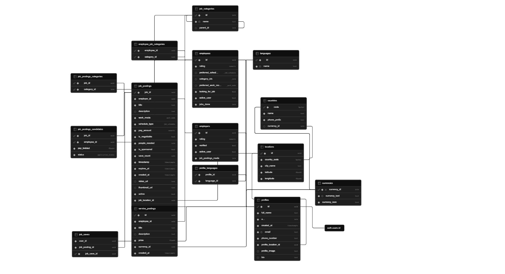

# Workly

A cross-platform mobile application built with **Expo** and **React Native**, backed by **Supabase**. Workly features authentication, a dashboard, an explore/discovery screen, a social feed, post creation, and user profiles — all in a clean, file-based routing structure powered by Expo Router.

---
# Test Accounts

 Email: workly.test1@gmail.com \
 Password: Workly123! 

---
## Tech Stack

| Layer | Technology |
|---|---|
| Framework | Expo ~54 / React Native 0.81 |
| Language | TypeScript 5.9 |
| Routing | Expo Router (file-based) |
| Backend / Auth | Supabase |
| Navigation | React Navigation (bottom tabs, stack, material top tabs) |
| Maps | React Native Maps + Google Maps |
| Animations | React Native Reanimated 4 |
| Lists | Shopify Flash List |
| Icons | Expo Vector Icons, Lucide React Native |
| Build | EAS Build |

---

## Database Schema



---

## Project Structure
```
app/
├── (tabs)/
│ ├── dashboard.tsx # Main dashboard screen
│ ├── explore.tsx # Discover/search screen
│ ├── feed.tsx # Social activity feed
│ ├── post.tsx # Create a post
│ └── profile.tsx # User profile
├── auth/ # Auth-related screens/logic
├── components/ # Shared UI components
├── constants/ # App-wide constants
├── hooks/ # Custom React hooks
├── lib/ # Supabase client & utilities
├── login.tsx # Login screen
├── signup.tsx # Sign-up screen
└── verifyEmail.tsx # Email verification screen
assets/ # Icons, images, splash
supabase/ # Supabase config / migrations
```
---

## Getting Started

### Prerequisites

- [Node.js](https://nodejs.org/) (LTS recommended)
- [Expo CLI](https://docs.expo.dev/get-started/installation/)
- An [Expo](https://expo.dev/) account (for EAS builds)
- A [Supabase](https://supabase.com/) project

### Installation
https://github.com/micuchichu/app/releases/tag/v1.0 

Or build it yourself:
```bash
git clone https://github.com/micuchichu/app.git
cd app
npm install
```

### Environment Variables

Create a `.env` file in the root:

```env
EXPO_PUBLIC_SUPABASE_URL=your_supabase_url
EXPO_PUBLIC_SUPABASE_ANON_KEY=your_supabase_anon_key
```

### Running the App

```bash
# Start Expo dev server
npx expo start

# Run on Android
npx expo run:android

# Run on iOS
npm run ios

```

---

## Building for Production

This project uses [EAS Build](https://docs.expo.dev/build/introduction/).

```bash
npm install -g eas-cli

eas build --platform android
eas build --platform ios
```
--- 
## Showcase

Check out these short demos of the app in action:

[](https://youtube.com/shorts/eSvYA3ZIK8c)
[](https://youtube.com/shorts/rauKAnaPsD4)
